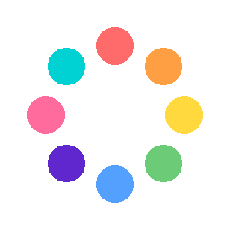

<div align="center">
  
  <h1>Orbby Assistant（奥比助手）</h1>
  <p>一款常驻桌面的电脑助手，可以帮助你完成日常任务</p>

  
  
  

</div>

---

## ✨ 功能介绍

### 🪟 桌面悬浮球

可拖拽的悬浮球助手，自动吸附到屏幕边缘，旋转适配贴边方向。悬停展开菜单面板，快速访问各项功能。

<div align="center">
  
  
</div>

### 🎨 主题与外观

支持多种主题切换，毛玻璃效果（Windows Acrylic / macOS 半透明背景），圆角无边框窗口。

<div align="center">
  
  
</div>

### 💡 核心功能

- **🎛️ 自定义菜单** — 开启和关闭你想显示的功能
- **🖼️ 照片墙** — 放置你喜欢的照片，定时轮播
- **💰 API 管理** — 实时显示 API 余额（支持 DeepSeek / OpenAI / Anthropic 等多平台），可切换平台 API，为 Agent 和翻译等提供 LLM 支持
- **📝 笔记管理** — 待办 / 笔记列表，支持增删改查、勾选完成、标记、导入导出
- **🚀 应用中心** — 快速启动常用应用的面板，应用自带多种工具，同样可以将自定义软件工具加入到应用中心，方便快速启动
- **📂 文件收藏** — 拖动文件到悬浮球可加入收藏，支持自定义多个目录
- **🤖 AI Agent** — 通过对话完成你交给他的工作任务
- **🖥️ Claude Code 任务监控** — 实时展示后台 Claude Code 任务进度

<div align="center">
  
  
  
</div>

### 🔌 插件工具

支持插件扩展，内置图像处理器、屏幕录制等工具，可通过应用中心一键启动。

<div align="center">
  
  
</div>

---

## 🚀 快速开始

### 环境要求

- Flutter SDK 3.12+
- Windows 10+ / macOS 11+ / Linux

### 运行

```bash
# 克隆仓库
git clone https://github.com/yisroelyue/orbby.git
cd orbby

# 安装依赖
flutter pub get

# 运行
flutter run -d windows   # Windows
```

### 构建

```bash
flutter build windows --release
```

---

## 🏗️ 技术栈

- **Flutter** — UI 框架
- **nodejs** — AI Agent 执行引擎

---

## 📄 许可

MIT License
